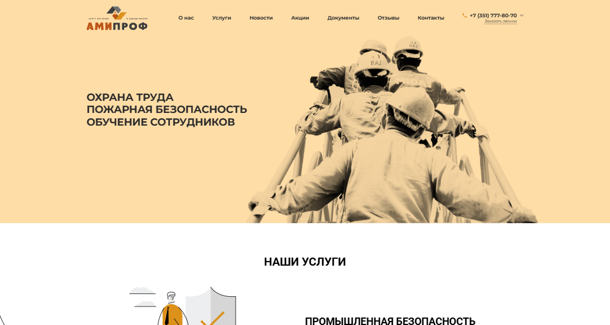
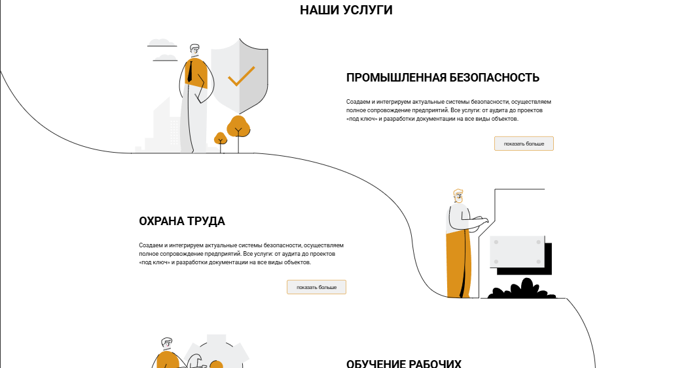
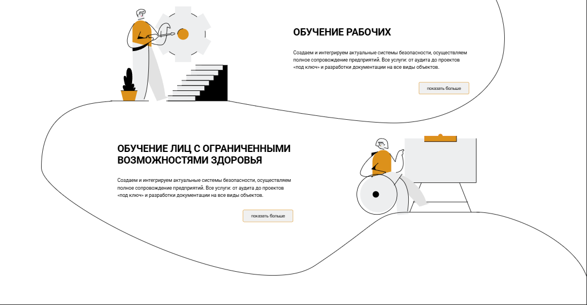
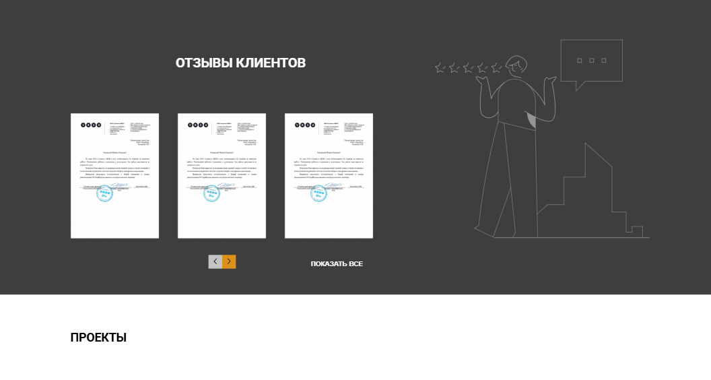
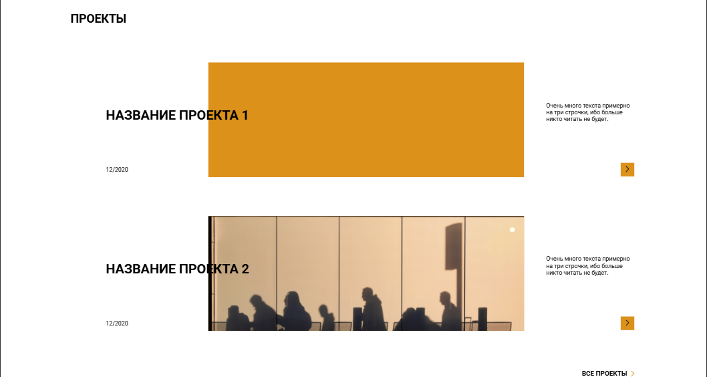
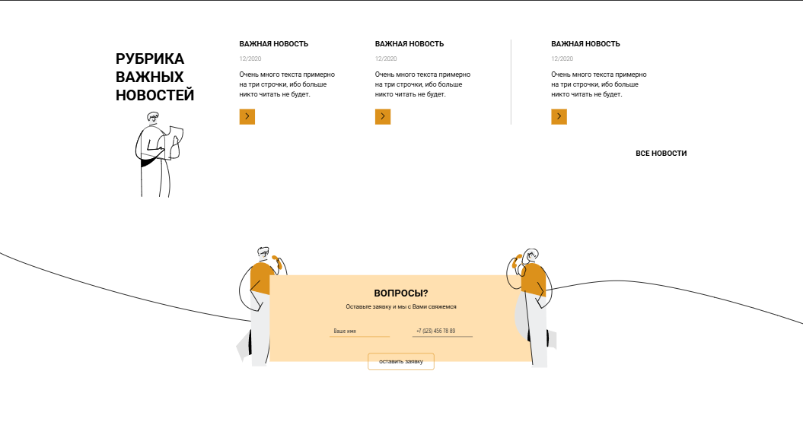
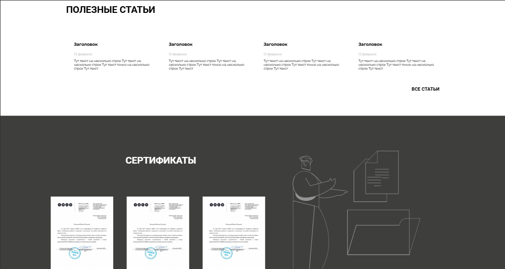
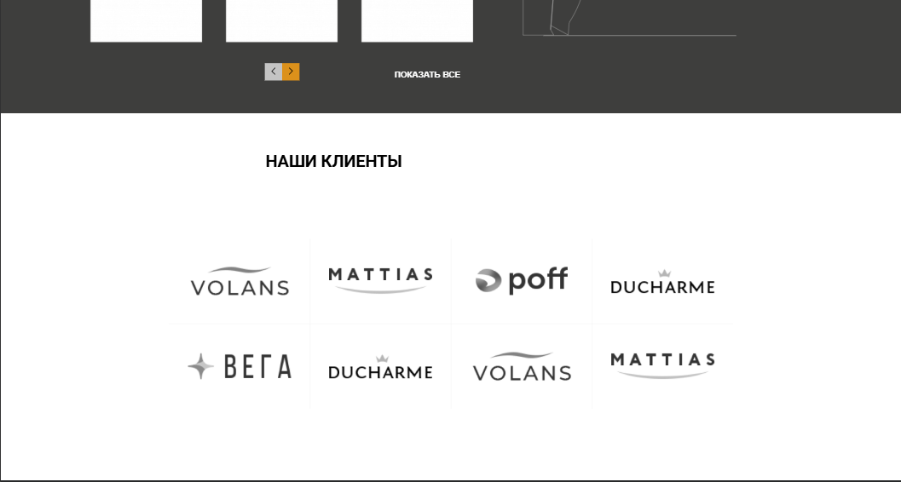
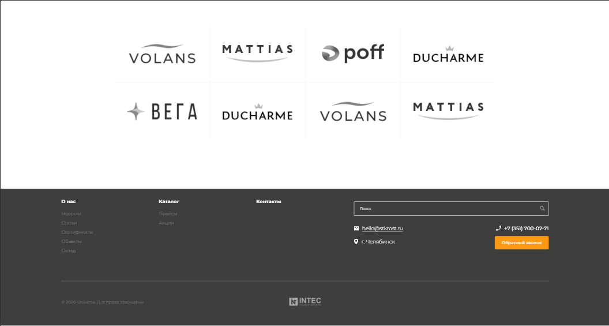

<!-- Repository name -->
<h1>Testing order by company "INTEC" for layout creation</h1>

<!-- Translates -->

<!-- Table of contents -->
<h2>Table of contents</h2>
<ul>

<!-- Installation -->
<li>
    <a href="#installation">Installation</a>
    <ul>
        <li>
            <a href="#installation-clone">Clone repository</a>
        </li>
    </ul>
</li>

<!-- Launch -->
<li>
    <a href="#launch">Launch</a>
</li>

<!-- Project structure -->
<li>
    <a href="#structure">Project structure</a>
</li>

<!-- Demonstration -->
<li>
    <a href="#demo">Demonstration</a>
</li>

<!-- Work done that is not included in the figma design file -->
<li>
    <a href="#non-figma-work">Work done that is not included in the figma design file</a>
</li>

<!-- Remarks -->
<li>
    <a href="#remark">Remarks</a>
</li>
</ul>

<!-- Installation -->
<h2><a id="installation">Installation</a></h2>
<ul>
<!-- Clone repository -->
<li>
    <a id="installation-clone">Clone this repository</a>
    <pre>git clone https://github.com/SkalZOne/intec_testing_order.git</pre>
</li>

✅Great, you can now move on to the "Startup" section.✅
</ul>

<!-- Launch -->
<h2><a id="launch">Launch</a></h2>
<ul>
    <li>
        Go to website directory
        <pre>cd intec_testing_order</pre>
    </li>
    <li>
        Launch <b>index.html</b> file
    </li>
</ul>
<h4>✅ Done ✅</h4>
After completing these steps, the project's main page will open in your default browser.

<!-- Project structure -->
<h2><a id="structure">Project structure</a></h2>
<ul>
    <li>Website index file - <b>index.html</b></li>
    <li>Website main folder - <b>assets/</b></li>
    <li>CSS files - <b>assets/css/</b></li>
    <li>Images
    <ul>
        <li>.png - <b>assets/css/png/</b></li>
        <li>.svg - <b>assets/css/svg/</b></li>
    </ul>
    </li>
    <li>Scripts (which are not there :laughing:) - <b>assets/js/</b></li>
    <li>Folder with images for README - <b>Readme/ReadmeImages/</b></li>
</ul>

<!-- Demonstration -->
<h2><a id="demo">Demonstration</a></h2>

<!-- Work done that is not included in the figma design file -->
<h2><a id="non-figma-work">Work done that is not included in the figma design file</a></h2>

Open me

> [!IMPORTANT]  
> I can do this unauthorized work only on a test task. During actual development, I will always consult in advance.
   
<ul>

Added bottom line animation for links in the navigation container

</img>

Added animation when hovering over links in the site footer

</img>

Added animation of the feedback button in the footer of the site

</img>

</ul>

<!-- Remarks -->
<h2><a id="remark">Remarks</a></h2>
<ul>
    <li>Since I decided to complete the project in one day (which was a critical mistake :sleepy:), I made the last commits in a very tired state, and more specifically these: 
     
    so I could make very stupid and offensive mistakes in them
    </li>
    <li>
    I also ask you to draw your attention to my other projects.   I will go progressively, <b>the further it goes, the more complex and voluminous the project was</b>.  If you cannot take the time to look at all the points, then it is better to start from the end.   However, I still <b>recommend reading everything from the very beginning, since these points contain a chronology of my growth as a developer</b>:
    </li>
    <li>
        

            
Layout: "EverAfter" on native <b>HTML and CSS</b>

            <b>Tech stack:</b> 
            <ul>
                <li>HTML</li>
                <li>CSS</li>
            </ul>
            <b>Description:</b> 
            One of the most basic works, using native HTML and CSS 
            <a href="https://github.com/SkalZOne/second_verst">Project link</a>
        

    </li>
    <li>
        

            
Layouts: "NanoCard" and "FigmaLand" on <b>SASS and Gulp</b>

            <b>Tech stack:</b> 
            <ul>
                <li>HTML</li>
                <li>CSS</li>
                <li>SASS</li>
                <li>Gulp</li>
            </ul>
            <b>Description:</b> 
            This contains two projects at once, since they are not very different in their stack  
            I have already learned the SASS preprocessor and learned the Gulp builder along with it.  
            Here we can still see very old and most likely (I don’t remember anymore :sweat_smile:) Gulp configs taken from the Internet 
            <a href="https://github.com/SkalZOne/gulp_SASS_first_verst">Project link "NanoCard"</a>
             
            <a href="https://github.com/SkalZOne/Gulp_SASS_Second_Verst">Project link "FigmaLand"</a>
        

    </li>
    <li>
        

            
Layouts: "IroRun" and "DSI" on <b>SASS, Gulp and Pug</b>

            <b>Tech stack:</b> 
            <ul>
                <li>HTML</li>
                <li>CSS</li>
                <li>SASS</li>
                <li>Gulp</li>
                <li>Pug</li>
            </ul>
            <b>Description:</b> 
            These are my first projects after learning the Pug  preprocessor
            They are also almost indistinguishable from each other, so I decided to put them in one block 
            <a href="https://github.com/SkalZOne/GSP_First_Verst">Project link "IroRun"</a>
             
            <a href="https://github.com/SkalZOne/GSP_Second_Verst">Project link "DSI"</a>
        

    </li>
    <li>
        

            
Layouts: "Muncim.Ro" and "ehya" <b>in my config Gulp</b>

            <b>Tech stack:</b> 
            <ul>
                <li>HTML</li>
                <li>CSS</li>
                <li>SASS</li>
                <li>Gulp</li>
                <li>Pug</li>
            </ul>
            <b>Description:</b> 
            This project already has its own configs on Gulp, I remember how it took me about 4 days to set it all up and connect it :sweat_smile: 
            <a href="https://github.com/SkalZOne/GSPC_First_Verst">Project link "Muncim.Ro"</a>
             
            <a href="https://github.com/SkalZOne/Rew.1-GSPC_First_Verst">Project link "ehya"</a>
        

    </li>
    <li>
        

            
<b>Closing the "gestalt"</b>called Gulp and creating your own full-fledged config with the assembly

            <b>Tech stack:</b> 
            <ul>
                <li>HTML</li>
                <li>CSS</li>
                <li>SASS</li>
                <li>Gulp</li>
                <li>Pug</li>
            </ul>
            <b>Description:</b> 
            In this project, I decided to make my own completely self-written Gulp config and implement several invented methods; at that time it was very difficult, because I had to code in JavaScript, which I did not know at all. 
             
            After that, I decide to study JavaScript in depth and end up getting so immersed that I study the React.js framework and go freelance, completely giving up on Git. 
            <a href="https://github.com/SkalZOne/gulp_default">Project link</a>
        

    </li>
    <li>
        

            
First project on <b>PHP</b>

            <b>Tech stack:</b> 
            <ul>
                <li>HTML</li>
                <li>CSS</li>
                <li>JavaScript</li>
                <li>MySQL</li>
                <li>PHP</li>
            </ul>
            <b>Description:</b> 
            After some reflection on the direction of my development as a developer and working as a freelancer, I decide to learn PHP and after that I return to Git not as a front-end, but as a back-end developer and write my first CRUD in PHP  
            <a href="https://github.com/SkalZOne/CRUD_PHP">Project link</a>
        

    </li>
    <li>
        

            
Small for the industry, but big for personal development <b>the first FullStack project</b> 

            <b>Tech stack:</b> 
            <ul>
                <li>TailwindCSS</li>
                <li>Laravel (PHP)</li>
                <li>MySQL</li>
                <li>Next.js (React)</li>
            </ul>
            <b>Description:</b> 
            My first FullStack project on the <b>Next.js and Laravel frameworks.</b> 
             
            The project is super simple, but for me it was a big step forward in development. 
            <a href="https://github.com/SkalZOne/Fullstack_Laravel-Next">Project link</a>
        

    </li>
    <li>
        

            
One of the student projects: <b>service center: “We’ll fix it!”</b>

            <b>Tech stack:</b> 
            <ul>
                <li>JavaScript</li>
                <li>Laravel (PHP)</li>
                <li>MySQL</li>
                <li>Docker</li>
            </ul>
            <b>Description:</b> 
            The project is entirely written in PHP with the Laravel framework. 
             
            The following logic was implemented:
            <ul>
                <li>Authorization</li>
                <li>Registration</li>
                <li>Data validation</li>
                <li>Exit</li>
                <li>Deleting an account</li>
                <li>Creating a repair request</li>
                <li>Editing an application</li>
            </ul>
            The first complete documentation for installing the project was written.  
             
            There is also a video showing how the site works.  
            <a href="https://github.com/SkalZOne/Laravel_ServiceCenter">Project link</a>
        

    </li>
    <li>
        

            
(Bonus) Commercial project Stack_Up, which is still under development

            <b>Tech stack:</b> 
            <ul>
                <li>TailwindCSS</li>
                <li>Next.js (React)</li>
                <li>Laravel (PHP)</li>
                <li>MySQL</li>
                <li>Docker</li>
            </ul>
            <b>Description:</b> 
            The largest project that has been in development for about 4 months. 
            A lot of logic has already been implemented, both in the front-end part, for example <b>full parsing and rendering of markdown files</b>, and in the back-end part, for example <b>creating individual filtering classes and interfaces in OOP.</b> 
             
            Since this is a commercial project, I will only be able to show some parts of the work of this project.  
             
            There is both a video demonstrating the operation of this system and a design file in figma, completely designed by me.
        

    </li>
</ul>