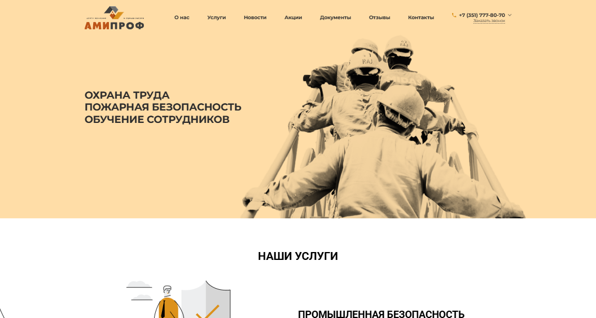
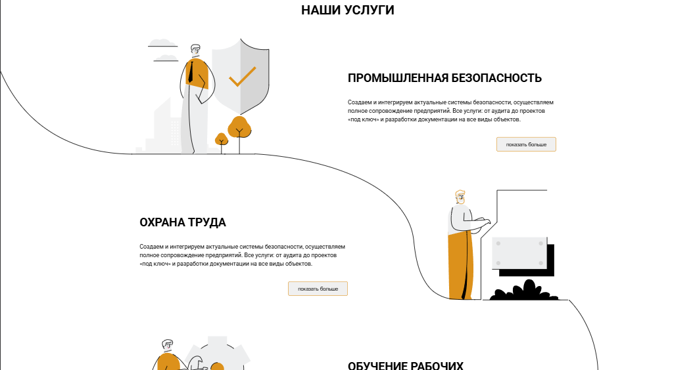
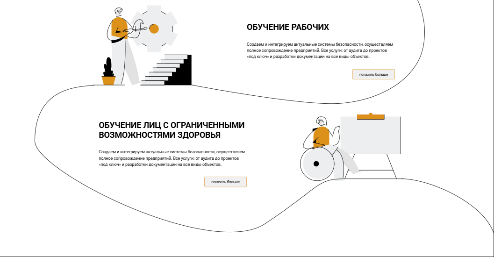
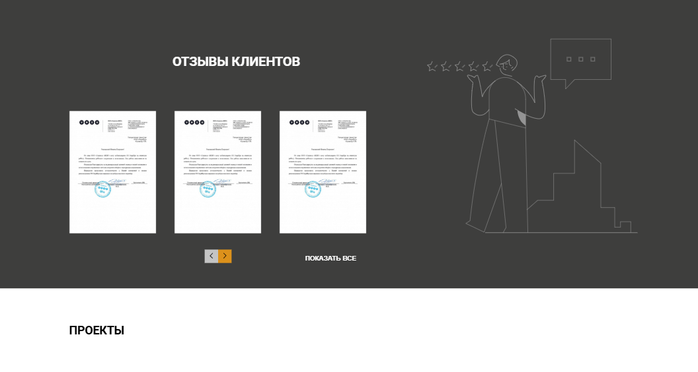
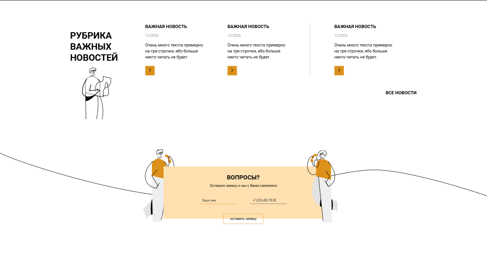
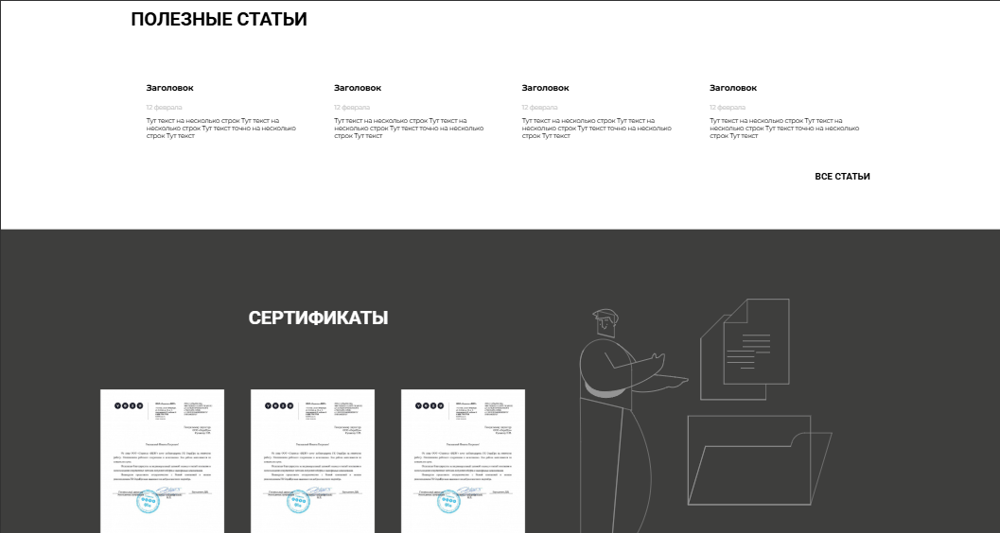
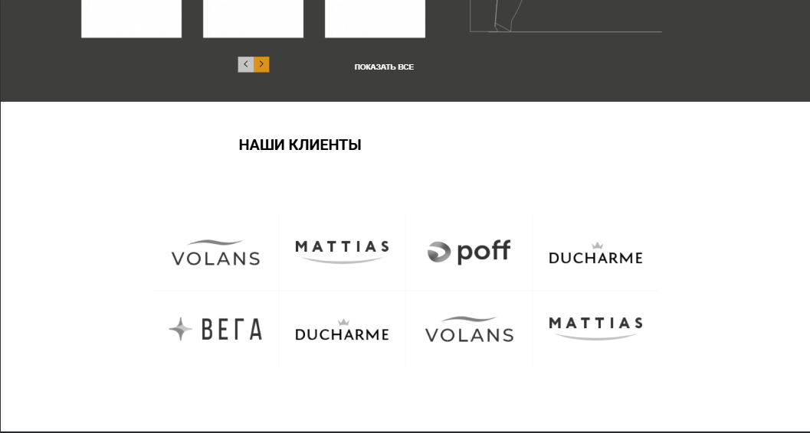
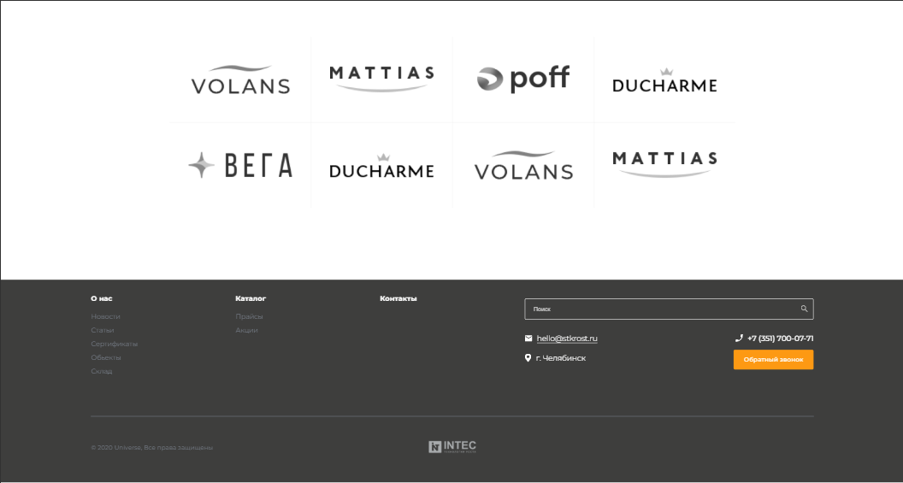
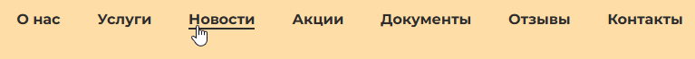
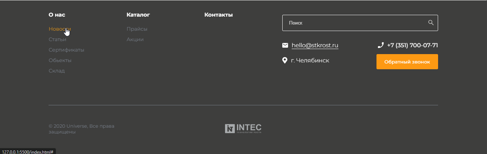

<!-- Название репозитория -->
<h1>Тестовый заказ от компании "INTEC" на верстку макета</h1>

<!-- Переводы -->

<!-- Оглавление -->
<h2>Оглавление</h2>
<ul>

<!-- Установка -->
<li>
    <a href="#installation">Установка</a>
    <ul>
        <li>
            <a href="#installation-clone">Склонировать репозиторий</a>
        </li>
    </ul>
</li>

<!-- Запуск -->
<li>
    <a href="#launch">Запуск</a>
</li>

<!-- Структура проекта -->
<li>
    <a href="#structure">Структура проекта</a>
</li>

<!-- Демонстрация работы -->
<li>
    <a href="#demo">Демонстрация работы</a>
</li>

<!-- Сделанная работа не входящая в файл дизайна фигмы -->
<li>
    <a href="#non-figma-work">Сделанная работа не входящая в файл дизайна фигмы</a>
</li>

<!-- Примечания -->
<li>
    <a href="#remark">Примечания</a>
</li>
</ul>

<!-- Установка -->
<h2><a id="installation">Установка</a></h2>
<ul>
<!-- Склонировать репозиторий -->
<li>
    <a id="installation-clone">Склонировать репозиторий</a>
    <pre>git clone https://github.com/SkalZOne/intec_testing_order.git</pre>
</li>

✅Отлично, теперь вы можете перейти в раздел "Запуск".✅

</ul>

<!-- Запуск -->
<h2><a id="launch">Запуск</a></h2>
<ul>
    <li>
        Перейти в директорию сайта
        <pre>cd intec_testing_order</pre>
    </li>
    <li>
        Запустить файл <b>index.html</b>
    </li>
</ul>
<h4>✅ Готово ✅</h4>
После выполнения этих действий в браузере по умолчанию откроется главная страница проекта.

<!-- Структура проекта -->
<h2><a id="structure">Структура проекта</a></h2>
<ul>
    <li>Входной файл сайта - <b>index.html</b></li>
    <li>Основная папка сайта - <b>assets/</b></li>
    <li>CSS файлы - <b>assets/css/</b></li>
    <li>Изображения
    <ul>
        <li>.png - <b>assets/css/png/</b></li>
        <li>.svg - <b>assets/css/svg/</b></li>
    </ul>
    </li>
    <li>Скрипты (которых нету :laughing:) - <b>assets/js/</b></li>
    <li>Папка с изображениями для README - <b>Readme/ReadmeImages/</b></li>
</ul>

<!-- Демонстрация работы -->
<h2><a id="demo">Демонстрация работы</a></h2>

<!-- Сделанная работа не входящая в файл дизайна фигмы -->
<h2><a id="non-figma-work">Сделанная работа не входящая в файл дизайна фигмы</a></h2>

Откройте меня

> [!IMPORTANT]  
> Данное самовольничество я будет только на тестовом задании. На реальной разработке я всегда буду предварительно консультироваться.

<ul>

Добавлена анимация нижней линии для ссылок в навигационном контейнере

</img>

Добавлена анимация при наведении на ссылки в подвале сайта

</img>

Добавлена анимация кнопки обратной связи в подвале сайта

</img>

</ul>

<!-- Примечания -->
<h2><a id="remark">Примечания</a></h2>
<ul>
    <li>Так как я решил сделать проект за один день (что было критической ошибкой :sleepy:), последние коммиты я делал в очень уставшем состоянии, а конкретнее эти: 
     
    поэтому в них я мог допустить очень глупые и обидные ошибки
    </li>
    <li>
    Также прошу обратить ваше внимание на свои остальные проекты.   Буду идти по нарастающей, <b>чем дальше тем сложнее и обьемнее был проект</b>.  Если вы не можете уделить времени на просмотр всех пунктов, тогда лучше начать с конца.   Однако я все равно <b>рекомендую прочитать все с самого начала, так как в данных пунктах есть хронология моего роста как разработчика</b>:
    </li>
    <li>
        

            
Верстка: "EverAfter" на нативном <b>HTML и CSS</b>

            <b>Стек:</b> 
            <ul>
                <li>HTML</li>
                <li>CSS</li>
            </ul>
            <b>Описание:</b> 
            Одна из самых базовых работ, на нативном HTML и CSS 
            <a href="https://github.com/SkalZOne/second_verst">Ссылка на проект</a>
        

    </li>
    <li>
        

            
Верстка: "NanoCard" и "FigmaLand" на <b>SASS и Gulp</b>

            <b>Стек:</b> 
            <ul>
                <li>HTML</li>
                <li>CSS</li>
                <li>SASS</li>
                <li>Gulp</li>
            </ul>
            <b>Описание:</b> 
            Тут содержится сразу два проекта, так как они не сильно отличаются по своему стеку  
            Я уже успел изучить препроцессор SASS и вместе с ним изучил сборщик Gulp.  
            Здесь ещё наблюдаются очень старые и скорее всего (уже не помню :sweat_smile:) взятые из интернета конфиги Gulp-а 
            <a href="https://github.com/SkalZOne/gulp_SASS_first_verst">Ссылка на проект "NanoCard"</a>
             
            <a href="https://github.com/SkalZOne/Gulp_SASS_Second_Verst">Ссылка на проект "FigmaLand"</a>
        

    </li>
    <li>
        

            
Верстка: "IroRun" и "DSI" на <b>SASS, Gulp и Pug</b>

            <b>Стек:</b> 
            <ul>
                <li>HTML</li>
                <li>CSS</li>
                <li>SASS</li>
                <li>Gulp</li>
                <li>Pug</li>
            </ul>
            <b>Описание:</b> 
            Это мои первые проекты после изучения препроцессора Pug 
            Они также почти ничем не отличаются между друг другом, так что я решил их засунуть в один блок 
            <a href="https://github.com/SkalZOne/GSP_First_Verst">Ссылка на проект "IroRun"</a>
             
            <a href="https://github.com/SkalZOne/GSP_Second_Verst">Ссылка на проект "DSI"</a>
        

    </li>
    <li>
        

            
Верстка: "Muncim.Ro" и "ehya" <b>на своем конфиге Gulp</b>

            <b>Стек:</b> 
            <ul>
                <li>HTML</li>
                <li>CSS</li>
                <li>SASS</li>
                <li>Gulp</li>
                <li>Pug</li>
            </ul>
            <b>Описание:</b> 
            В этом проекте уже наблюдаются свои конфиги на Gulp-е, помню как я около 4ех дней это все настраивал и подключал :sweat_smile: 
            <a href="https://github.com/SkalZOne/GSPC_First_Verst">Ссылка на проект "Muncim.Ro"</a>
             
            <a href="https://github.com/SkalZOne/Rew.1-GSPC_First_Verst">Ссылка на проект "ehya"</a>
        

    </li>
    <li>
        

            
<b>Закрытие "гештальта"</b> под названием Gulp и создание своего полноценного конфига со сборкой

            <b>Стек:</b> 
            <ul>
                <li>HTML</li>
                <li>CSS</li>
                <li>SASS</li>
                <li>Gulp</li>
                <li>Pug</li>
            </ul>
            <b>Описание:</b> 
            В данном проекте я решил сделать полностью свой самописный конфиг Gulp и реализовать несколько придуманных методов, на тот момент это было очень тяжко, потому что приходилось кодить на языке JavaScript, который я совершенно не знал. 
             
            После этого я решаю углубленно изучить JavaScript и в итоге настолько сильно погружаюсь, что изучаю фреймворк React.js и ухожу во фриланс, полностью забив на гит. 
            <a href="https://github.com/SkalZOne/gulp_default">Ссылка на проект</a>
        

    </li>
    <li>
        

            
Первый проект на языке <b>PHP</b>

            <b>Стек:</b> 
            <ul>
                <li>HTML</li>
                <li>CSS</li>
                <li>JavaScript</li>
                <li>MySQL</li>
                <li>PHP</li>
            </ul>
            <b>Описание:</b> 
            После некоторой рефлексии на тему направления своего развития как разработчика и работы на фрилансе я решаю изучить PHP и после этого возвращаюсь на гит уже не как фронтенд, а как бэкенд разработчик и пишу свой первый CRUD на языке PHP  
            <a href="https://github.com/SkalZOne/CRUD_PHP">Ссылка на проект</a>
        

    </li>
    <li>
        

            
Маленький для индустрии, но большой для личного развития <b>первый FullStack проект</b> 

            <b>Стек:</b> 
            <ul>
                <li>TailwindCSS</li>
                <li>Laravel (PHP)</li>
                <li>MySQL</li>
                <li>Next.js (React)</li>
            </ul>
            <b>Описание:</b> 
            Мой первый FullStack проект на фреймворках <b>Next.js и Laravel.</b> 
             
            Проект супер простой, однако для меня это был большой шаг для продвижения в сфере разработки. 
            <a href="https://github.com/SkalZOne/Fullstack_Laravel-Next">Ссылка на проект</a>
        

    </li>
    <li>
        

            
Один из студенческих проектов: <b>сервисный центр: "Починим!"</b>

            <b>Стек:</b> 
            <ul>
                <li>JavaScript</li>
                <li>Laravel (PHP)</li>
                <li>MySQL</li>
                <li>Docker</li>
            </ul>
            <b>Описание:</b> 
            Проект полностью написанный на PHP языке с фреймворком Laravel. 
             
            Была реализованы следующая логика:
            <ul>
                <li>Авторизация</li>
                <li>Регистрация</li>
                <li>Валидация данных</li>
                <li>Выход</li>
                <li>Удаление аккаунта</li>
                <li>Создание заявки на ремонт</li>
                <li>Редактирование заявки</li>
            </ul>
            Была написана первая полноценная документация по установке проекта.  
             
            Также имеется видео с работой сайта.  
            <a href="https://github.com/SkalZOne/Laravel_ServiceCenter">Ссылка на проект</a>
        

    </li>
    <li>
        

            
(Бонус) Коммерческий проект Stack_Up, который все ещё на стадии разработки

            <b>Стек:</b> 
            <ul>
                <li>TailwindCSS</li>
                <li>Next.js (React)</li>
                <li>Laravel (PHP)</li>
                <li>MySQL</li>
                <li>Docker</li>
            </ul>
            <b>Описание:</b> 
            Самый крупный проект, который находится в разработке уже около 4-ех месяцев. 
            Уже было реализовано очень много логики, как во фронтенд части, например <b>полный парсинг и рендеринг markdown файлов</b>, так и бекенд части, например <b>создание индивидуальных фильтрационных классов и интерфейсов в ООП.</b> 
             
            Так как это коммерческий проект, я смогу показать только какие-то части работы данного проекта.  
             
            Есть как видео демонстрации работы данной системы, так и файл дизайна в фигме, полностью спроектированный мной.
        

    </li>
</ul>
